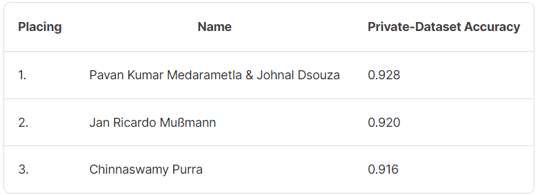

## Kaggle Deep Learning Classification Challenge
 
This challenge is part of the Deep Learning course offered by University of Siegen, Germany. Our model scored 92.8% accuracy on the Leaderboard, ranking us the 1st place.
 

  

 
The dataset consist of 8 classes consisting of Christmas Objects such as Christmas Cookies, Christmas Presents, Christmas Tree, Fireworks, penguin, reindeer, Santa, Snowman.
The model used was Efficientnet_b4.  
 
 
Link to Challenge: https://kaggle.com/competitions/deep-learning-classification-challenge
